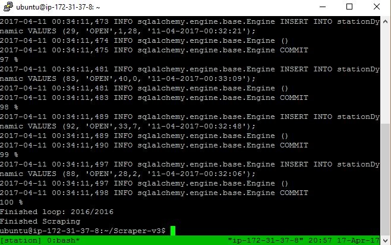
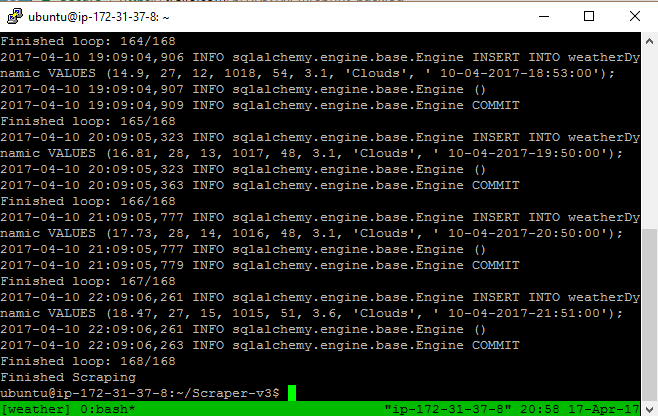
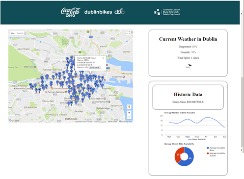

# DublinBikes
## Dublin Bikes Flask Application

These files were used to develop a Dublin Bikes web application.
As part of the project the following was undertaken:

- Setting up of a Python web scraper that parsed JSON data and added it to an AWS RDS MySQL instance
- Development and hosting of Python Flask application via AWS EC2 instance
- Use of DublinBikes and OpenWeatherMaps APIs
- Use of AWS S3 for backup storage

## Scraper Screenshots

## Website Screenshot

